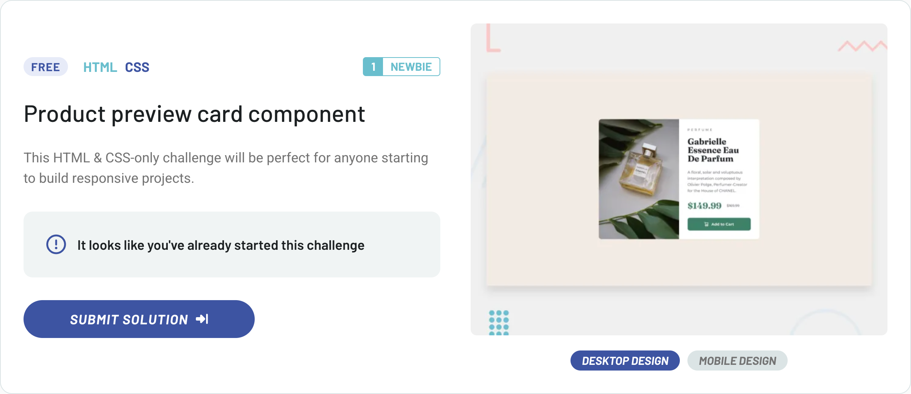

# Frontend Mentor – [Product Preview Card Component]

  
Other status options

  
- 
- 
- 
- 
- 
- 

 

This is my solution for the [Product Preview Card Component](https://www.frontendmentor.io/challenges/product-preview-card-component-GO7UmttRfa) challenge from Frontend Mentor.

---

## 🔗 Live demo

👉 [View deployed version](https://my-demo.netlify.app)

---

## 🛠 Technologies used

- HTML5 + BEM naming convention  
- SCSS with `@use`, `@forward`, and modular architecture (`variables/`, `mixins/`)  
- Flexbox layout (mobile-first) with media queries and spacing via SCSS variables  
- Responsive images using `<picture>` with device-specific sources  
- Accessible markup (semantic tags, proper `alt`, `aria-hidden`, keyboard focus styles)  
- Manual SCSS build with Vite (no UI framework or CSS utility library)  

---

## 📁 Project structure

- **`assets/`** - static files, e.g. images or favicons
- **`assets/images/`** - images used in the component (QR code)
- **`scss/`** - modules with global styles, variables, mixins
- **`index.html`** - HTML structure of the component with BEM classes
- **`main.js`** - entry point for loading styles (via SCSS)
- **`dist/`** - folder for built output (ignored in Git)

---

## ✨ What I focused on

- Clean, minimalist solution with a consistent HTML and SCSS structure  
- Using a modern SCSS architecture (`@use`, `@forward`, modular `variables/`, `mixins/`)  
- Pixel-perfect match to the Figma design, including precise spacing, typography, and visual hierarchy  
- Responsive behavior using `<picture>` and `object-fit` to match image scaling across devices  
- Semantic markup with accessible elements (e.g. proper alt text, keyboard-friendly buttons)  
- Fully mobile-first layout with BEM naming and no JS or external frameworks  

---

## 🧠 Key implementation notes

- The desktop and mobile designs share a single responsive component with layout adjustments via media queries (`min-width: 768px`)  
- Layout and spacing values match the Figma design exactly, including color and opacity conversions (e.g. hex to `hsla()` for consistent theming)  
- The product image switches based on viewport using the `<picture>` element with device-specific sources  
- Font families (`Fraunces` and `Montserrat`) are loaded via Google Fonts and mapped to SCSS variables for clarity and reuse  
- Focused on accessibility: semantic HTML (`main`, `h1`, `button`, `img` with descriptive `alt`), `aria-hidden` for decorative icons, and `:focus-visible` styling for keyboard users  

---

## ✍️ Author

- GitHub – [pavel-jiranek-tech](https://github.com/pavel-jiranek-tech)
- Frontend Mentor – [@pavel-jiranek-tech](https://www.frontendmentor.io/profile/pavel-jiranek-tech)

---

## 📝 License

This project is part of a challenge on Frontend Mentor and is intended for educational and portfolio purposes only.
