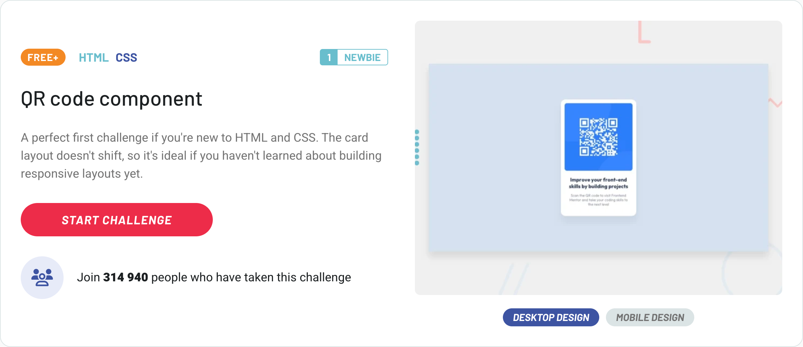

# Frontend Mentor – [QR code component]

## Status: 🟡 **IN PROGRESS**

<details>
  <summary>Other status options</summary>
- 🔴 *NOT STARTED*
- 🧪 *TESTING*
- 🚀 *DEPLOYED*
- ♻️ *REFACTORING*
- 🟢 *DONE*
</details>
<br />

My solution for the [QR code component](https://www.frontendmentor.io/challenges/qr-code-component-iux_sIO_H) challenge from Frontend Mentor.



## 🔗 Live demo

[View deployed version](https://my-demo.netlify.app)

## 🛠 Technologies used

- HTML5 + BEM
- SCSS (compiled manually or via script)
- Flexbox / CSS Grid

## 🚀 Project setup

1. **Install dependencies**

```bash
npm install
```

2. **Run development server (🧪Vite)**

```bash
npm run dev
```

3. **Automatic SCSS compilation during development**

```bash
npm run sass:watch
```

4. **Build SCSS for production**

```bash
npm run sass:build
```

5. **Open the project**

- Vite usually starts the dev server automatically (typically at `http://localhost:5173`)
- Or open `index.html` manually in your browser

## 📚 Notes

Short notes about what you tried, what was interesting or new.
