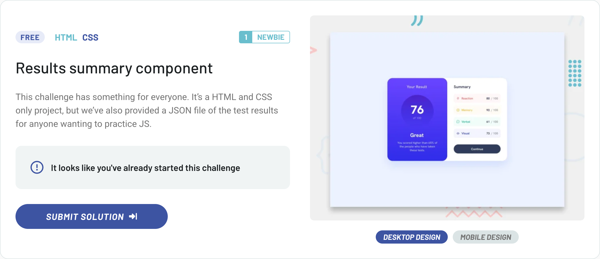

# Frontend Mentor – [Results Summary Component]

  
Other status options

  
- 
- 
- 
- 
- 
- 

 

This is my solution for the [Results Summary Component](https://www.frontendmentor.io/challenges/results-summary-component-CE_K6s0maV) challenge from Frontend Mentor.

---

## 🔗 Live demo

👉 [View deployed version](https://pj-fm-rsc.netlify.app)

---

## 🛠 Technologies Used

- **HTML5** with [BEM](https://en.bem.info/methodology/) naming convention
- **SCSS** using `@use`, modular file structure and partials
- **CSS Flexbox** for responsive layout and alignment
- **Manual SCSS build** without any CSS framework
- **Custom utility mixins** and spacing/typography variables
- **Decorative icons** handled semantically with `alt` and `aria-hidden`

---

## 📁 Project structure

- **`assets/`** - static files, e.g. images or favicons
- **`assets/images/`** - images used in the component (QR code)
- **`scss/`** - modules with global styles, variables, mixins
- **`index.html`** - HTML structure of the component with [BEM](https://en.bem.info/methodology/) classes
- **`main.js`** - entry point for loading styles (via SCSS)
- **`dist/`** - folder for built output (ignored in Git)

---

## ✨ What I Focused On

- A deliberately minimalist solution with clean and consistent HTML and SCSS structure
- Applying a modern SCSS architecture using `@use`, variables, and modular components
- Faithfully implementing the visual design from Figma, including gradient backgrounds and soft shadows
- Consistent use of [BEM](https://en.bem.info/methodology/) naming convention and mobile-first approach

---

## 🧠 Key Implementation Notes

- Mobile-first layout with a responsive desktop version handled via a single breakpoint (`768px`)
- All spacings, border radii and box-shadows were matched precisely to the Figma design, including alpha values in `hsla()` where applicable
- Google Font "Hanken Grotesk" was loaded via `<link>` and mapped to SCSS variables with weight variants (500, 700, 800)
- Layouts were implemented using semantic HTML elements (`main`, `section`, `h1`, `h2`, `p`, `img`) and accessible `alt`/`aria-hidden` for icons

---

## ✍️ Author

- GitHub – [pavel-jiranek-tech](https://github.com/pavel-jiranek-tech)
- Frontend Mentor – [@pavel-jiranek-tech](https://www.frontendmentor.io/profile/pavel-jiranek-tech)

---

## 📝 License

This project is part of a challenge on Frontend Mentor and is intended for educational and portfolio purposes only.
