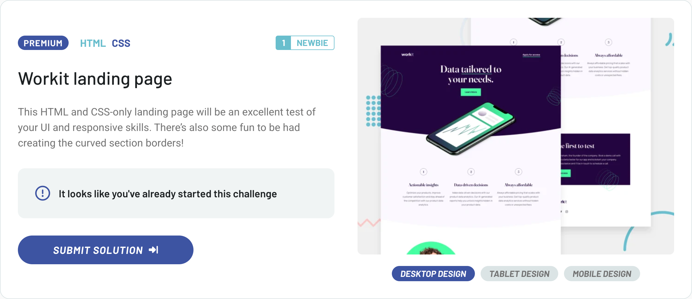

# Frontend Mentor – [Workit Landing Page]

  
Other status options

  
- 
- 
- 
- 
- 
- 

 

This is my solution for the [Workit Landing Page](https://www.frontendmentor.io/challenges/workit-landing-page-2fYnyle5lu) challenge from Frontend Mentor.

---

## 🔗 Live demo

👉 [View deployed version](https://pj-fm-wlp.netlify.app)

---

## 🛠 Technologies used

- **HTML5** with [BEM](https://en.bem.info/methodology/) naming convention
- **SCSS** using `@use`, modular file structure and partials
- **CSS Flexbox** for responsive layout and alignment
- **Manual SCSS build** without any CSS framework
- **Custom utility mixins** and spacing/typography variables
- **Decorative icons** handled semantically with `alt` and `aria-hidden`

---

## 📁 Project structure

- **`assets/`** - static files, e.g. images or favicons
- **`assets/images/`** - images used in the component (QR code)
- **`scss/`** - modules with global styles, variables, mixins
- **`index.html`** - HTML structure of the component with BEM classes
- **`main.js`** - entry point for loading styles (via SCSS)
- **`dist/`** - folder for built output (ignored in Git)

---

## ✨ What I focused on

- Building a clean and scalable HTML structure using semantic elements and [BEM](https://en.bem.info/methodology/) naming convention  
- Using a modern SCSS setup with `@use`, design tokens, partials, and responsive typography  
- Preserving visual fidelity with the Figma design, including typography, spacing, and decorative SVG elements  
- Implementing mobile-first responsive layouts with Flexbox and media queries  
- Avoiding frameworks to maintain full control over layout, interactivity, and accessibility  
- Ensuring accessibility with proper use of `alt`, `aria-label`, and decorative image handling (`aria-hidden`)

---

## 🧠 Key Implementation Notes

- The layout was implemented mobile-first, using media queries for tablet (`768px`) and desktop (`1120px`) breakpoints  
- Font sizes were defined via SCSS variables in `rem`, based on Figma values, and structured with responsive text presets  
- Decorative SVGs and background patterns were handled using `<picture>` for responsiveness and `aria-hidden` for accessibility  
- Flexbox was used throughout to align content and manage layout flow across viewports  
- The fonts "Fraunces" and "Manrope" were loaded from Google Fonts and integrated via SCSS variables  
- Accessibility best practices were followed, including semantic elements, image `alt` texts, and `aria-label` for non-text links (e.g. social icons)

---

## ✍️ Author

- GitHub – [pavel-jiranek-tech](https://github.com/pavel-jiranek-tech)
- Frontend Mentor – [@pavel-jiranek-tech](https://www.frontendmentor.io/profile/pavel-jiranek-tech)

---

## 📝 License

This project is part of a challenge on Frontend Mentor and is intended for educational and portfolio purposes only.
